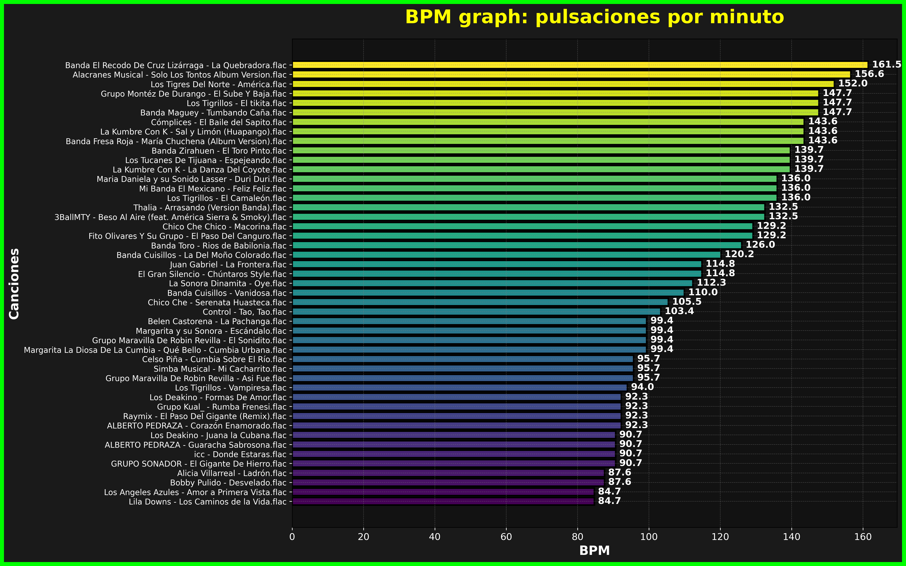

## BPMgraph 

BPMgraph es un contabilizar gráfico de los pulsos por minuto en pistas de audio que soporta archivos con extensiones .mp3, .wav, .flac, y .ogg.

Ejemplo 

## Instalación y uso 

Este manual te guiará en los pasos necesarios para instalar, configurar y utilizar el script para calcular los BPM de las canciones en un directorio.

### Requisitos previos 

Antes de comenzar, asegúrate de cumplir con los siguientes requisitos:

-    Python 3.7 o superior: Puedes descargarlo desde python.org.
-    Paquetes necesarios (dependencias): librosa, matplotlib, y tqdm
-    Archivos de audio compatibles: El script 

### Instalación y uso del script

#### Instalar dependencias

Abre una terminal y ejecuta los siguientes comandos en los sistemas operativos GNU/Linux:

    pip install librosa matplotlib tqdm

Esto instalará las bibliotecas necesarias.

#### Descargar el script

Descarga o copia el script y guárdalo como BPMgrpah.py o bien directamente por medio del comando git

  git clone https://github.com/nvjacobo/BPMgraph
    
### Uso del script

#### Preparar el entorno

Coloca las canciones que deseas analizar en un directorio específico (por ejemplo: /ruta/a/mis/canciones).

#### Ejecutar el script

En la terminal, navega hasta el directorio donde guardaste el script:

   cd BPMgraph

Ejecuta el script:

    python BPMgraph.py
    
El script te pedirá que ingreses la ruta del directorio que contiene tus canciones. Por ejemplo:
    
    
   /ruta/a/mis/canciones

Ingresar el directorio de canciones

#### Resultados 

Salida:

    Mensajes de progreso mientras se procesan las canciones:

    Procesando canciones: 100%|███████████████████████████████| 5/5 [00:15<00:00,  3.00s/canción]
    Generando gráfico...
    Gráfico guardado en bpm_graph.png

    Archivo generado:
        Nombre: bpm_graph.png
        Contenido: BPM graph: pulsaciones por minuto.

###  Solución de problemas
   
   Error: No se encuentran canciones

Asegúrate de que el directorio contiene archivos con extensiones compatibles: .mp3, .wav, .flac, .ogg.

   Error: No se puede abrir el archivo

###  Personalización

Si deseas personalizar el script:

    Cambiar colores:
        Modifica los colores alternados en la función plot_bpm_data:

    color=['#4caf50' if i % 2 == 0 else '#2196f3' for i in range(len(song_names))]

Guardar la gráfica en otro lugar:

    Cambia la ruta de salida output_path:

output_path = "/ruta/deseada/bpm_graph.png"

